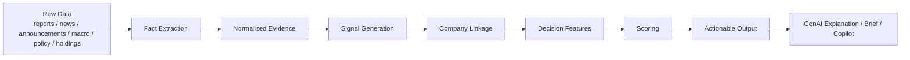

# InsightSync Decision Framework And Scoring Principles

Date: 2026-05-07

## 1. Why This Document Exists

InsightSync should not become a collection of ad hoc rules, isolated views, and subjective banker-style heuristics.

The system needs a defensible decision framework that answers four business questions consistently:

1. Is this company worth prioritizing now
2. Why now
3. What is the most plausible business entry angle
4. What risks or uncertainties should be surfaced before action

This document defines the recommended structure for:

- signal generation
- evidence linkage
- feature design
- scoring principles
- the role of GenAI in the pipeline

The goal is to reduce subjectivity while still producing actionable outputs for Hang Seng RM workflows.

## 2. Core Principle

The system should separate:

- facts
- signals
- linkage
- decision features
- scores
- explanations

These layers should not be collapsed into one step.

If the system jumps directly from raw data to final banker recommendations, the result becomes hard to validate, hard to tune, and too subjective.

## 3. Recommended Decision Stack

### Layer 1: Fact Extraction

Purpose:

- extract structured facts from raw structured and unstructured inputs

Examples:

- business event
- management statement
- funding event
- risk factor
- financial metric
- policy release
- macro indicator movement
- trade or cross-border context update

At this stage the system should avoid business judgment.

Example:

- good: "Company announced expansion into UAE"
- bad: "Company is a high-potential prospect"

### Layer 2: Normalized Evidence

Purpose:

- store extracted facts in a stable format for later use

Examples:

- parsed business events
- parsed metrics
- parsed risk factors
- trigger signals
- timeline events
- external intelligence records

This is the foundation for explainability and later citation.

### Layer 3: Signal Generation

Purpose:

- convert facts into standardized business-relevant signals

Signals should be limited to a controlled taxonomy, not free-form labels.

Recommended signal families:

- `growth_signal`
- `expansion_signal`
- `fundraising_signal`
- `cross_border_signal`
- `trade_signal`
- `policy_relevance_signal`
- `market_signal`
- `risk_signal`
- `regulatory_signal`

Each signal should carry:

- `signal_type`
- `source`
- `event_time`
- `evidence_ref`
- `confidence`
- `signal_strength`

The key principle is:

signals are still intermediate objects, not final recommendations.

### Layer 4: Company Linkage

Purpose:

- determine how a piece of evidence or signal is related to a company

This layer is critical because the biggest source of subjectivity in these systems is over-linking market context to company-level conclusions.

Recommended linkage taxonomy:

- `direct_company_link`
  The company is directly named or uniquely identified.

- `industry_link`
  The evidence is relevant because it applies to the company’s industry.

- `region_link`
  The evidence is relevant because it applies to the company’s geography or operating footprint.

- `cross_border_exposure_link`
  The evidence is relevant because it applies to the company’s overseas market, export direction, treasury exposure, or trade corridor.

- `macro_context_link`
  The evidence provides background context but should not be treated as a strong company-level opportunity signal on its own.

Recommended linkage strength:

- `strong`
- `medium`
- `weak`

Examples:

- A company-specific HKEX announcement: `direct_company_link`, `strong`
- A Guangdong export growth release for a Guangdong manufacturer: `region_link`, `medium`
- A broad HK rate move for a generic local SME: `macro_context_link`, `weak`

This distinction should directly influence scoring weights.

Plain-language explanation:

- `linkage taxonomy` means the system must say explicitly why one external item is connected to one company, instead of silently assuming that all market news applies equally.
- In practice, it answers one question: "this piece of evidence is related to this company through what path?"

Example:

- If an HKEX filing directly names Alpha Fintech, the linkage is `direct_company_link`.
- If a Guangdong export release is used for a Guangdong exporter, the linkage is `region_link`.
- If a broad Hong Kong rate update is only background context, the linkage is `macro_context_link`.

Example linkage table:

| Evidence example | Why it links to the company | Linkage type | Linkage strength | Scoring use |
| --- | --- | --- | --- | --- |
| HKEX filing naming Alpha Fintech | The company is directly identified | `direct_company_link` | `strong` | Can be used as a strong company-level feature |
| News about GCC payments expansion for payments firms | Relevant to the company’s industry | `industry_link` | `medium` | Can support opportunity hypotheses, but should not dominate alone |
| Guangdong export growth data for a Guangdong exporter | Relevant to the company’s operating region | `region_link` | `medium` | Can support trade or cross-border context |
| UAE fintech licensing update for a company entering UAE | Relevant to the company’s overseas footprint | `cross_border_exposure_link` | `medium` to `strong` | Can support cross-border opportunity reasoning |
| Broad HK interest-rate update with no direct company tie | Background environment only | `macro_context_link` | `weak` | Can be used as context, not as a strong company opportunity signal |

### Layer 5: Decision Features

Purpose:

- transform linked evidence into stable, auditable features used for ranking and recommendation

This is where the system should become quantitative.

Features should not be defined as vague banker intuition.

Each feature should have:

- a business meaning
- a precise definition
- an evidence source
- a linkage requirement
- an initial weight
- a calibration path

Recommended feature groups:

#### A. Commercial Attractiveness

Measures whether the company is commercially worth attention.

Example features:

- `growth_activity_intensity`
- `expansion_activity_intensity`
- `market_visibility`
- `operating_scale_proxy`
- `business_complexity_proxy`

#### B. Immediacy

Measures whether this is the right time to act.

Example features:

- `recent_signal_recency`
- `recent_announcement_recency`
- `recent_management_update`
- `active_market_context_alignment`

#### C. Product Fit

Measures whether the company’s current state is plausibly aligned with specific banking products.

Example features:

- `financing_fit`
- `trade_finance_fit`
- `cash_management_fit`
- `treasury_fit`
- `cross_border_payments_fit`
- `capital_markets_fit`

#### D. Risk Penalty

Measures whether the opportunity should be discounted or routed through caution.

Example features:

- `regulatory_risk_penalty`
- `distress_penalty`
- `uncertainty_penalty`
- `negative_signal_density`

#### E. Evidence Confidence

Measures how reliable the current judgment is.

Example features:

- `direct_evidence_ratio`
- `strong_linkage_ratio`
- `structured_evidence_coverage`
- `freshness_confidence`
- `source_diversity`

Important principle:

the system should surface both opportunity and confidence.

A company can look attractive but still have low evidence confidence.

Example feature dictionary:

| Feature key | Feature group | What it measures | Typical evidence | Linkage requirement | Initial interpretation |
| --- | --- | --- | --- | --- | --- |
| `growth_activity_intensity` | `commercial_attractiveness` | Whether the company shows meaningful growth or expansion activity | growth signals, expansion events, management discussion | Prefer `direct_company_link` | Higher means the company is more commercially interesting |
| `fundraising_intensity` | `product_fit` | Whether financing need is plausibly emerging | fundraising announcements, debt issuance, capex statements | Prefer `direct_company_link` | Higher means financing outreach is more relevant |
| `cross_border_operating_exposure` | `product_fit` | Whether the company has meaningful cross-border operating footprint | overseas expansion, export/trade evidence, cross-border signals | `direct_company_link` or `cross_border_exposure_link` | Higher means cross-border banking products are more relevant |
| `active_market_context_alignment` | `immediacy` | Whether market or policy context supports acting now | policy releases, market signals, regional indicators | `industry_link`, `region_link`, or `macro_context_link` | Higher means timing is more favorable, but usually only as support |
| `regulatory_risk_penalty` | `risk_penalty` | Whether regulatory or compliance concerns should reduce priority | risk factors, regulatory signals, warning signals | Prefer `direct_company_link` | Higher means more caution is required |
| `structured_evidence_coverage` | `evidence_confidence` | Whether the system has enough structured evidence to trust its own recommendation | parsed documents, metrics, business events, risk factors | Any explicit linkage | Higher means the recommendation is more trustworthy |
| `source_diversity` | `evidence_confidence` | Whether multiple independent sources support the same story | filings, reports, news, signals | Any explicit linkage | Higher means lower single-source bias |

Plain-language explanation:

- `feature dictionary` means a controlled list of measurable factors that the system is allowed to use for scoring.
- It prevents the code from growing into many hidden banker-style rules.
- In practice, it answers one question: "what exact inputs are allowed to influence priority, and what does each one mean?"

Example:

- `growth_activity_intensity`: the company recently showed multiple growth or expansion facts, so commercial attractiveness increases.
- `cross_border_operating_exposure`: the company has direct or linked cross-border evidence, so cross-border product relevance increases.
- `direct_evidence_ratio`: most evidence is directly linked to the company rather than only broad market context, so confidence increases.

## 4. Scoring Principles

### 4.1 What Should Be Scored

The system should not rely on one monolithic score alone.

Recommended outputs:

- `priority_score`
- `commercial_attractiveness_score`
- `immediacy_score`
- `product_fit_score`
- `risk_penalty_score`
- `evidence_confidence_score`

Suggested interpretation:

- `priority_score`: overall RM prioritization
- `commercial_attractiveness_score`: is the company broadly interesting
- `immediacy_score`: is this the right time
- `product_fit_score`: is there a plausible banking angle
- `risk_penalty_score`: what should reduce or constrain outreach
- `evidence_confidence_score`: how much trust to place in the recommendation

### 4.2 What Should Not Happen

The system should avoid:

- direct score assignment by free-form LLM output
- uncontrolled keyword counting
- background macro evidence being treated as strong company-specific opportunity evidence
- hidden rules that cannot be explained or audited

### 4.3 Initial Scoring Method

The first production-usable version can use expert-defined weighted features.

That is acceptable if the framework is:

- explicit
- documented
- evidence-linked
- testable
- recalibratable

This is much better than pretending a subjective ruleset is already a mature scoring engine.

### 4.4 Calibration Path

After the first explainable scoring version is stable, calibration should move through these stages:

1. expert-defined initial features and weights
2. case review with RM and product teams
3. labeled historical examples
4. feature adjustment and threshold tuning
5. later statistical or model-based calibration if enough outcome data exists

## 5. Opportunity Views Versus Opportunity Lenses

The system should not hard-code the world into only three fixed buckets.

However, for the current Hang Seng pre-acquisition phase, three opportunity lenses are the most defensible first set because they map directly to the stated business use cases:

- acquisition potential
- financing need
- cross-border opportunity

These should be treated as:

- business decision lenses
- not mutually exclusive categories
- not separate products

One company may score highly on multiple lenses at the same time.

Recommended structure:

- one unified company/prospect view
- multiple opportunity lenses underneath

This keeps the framework extensible for later additions such as:

- portfolio growth
- retention risk
- deepening opportunity
- sector-specific product fit

## 6. Where GenAI Should Actually Be Used

GenAI should not be treated as a decorative summary layer only.

It should be used in three constrained roles.

### Role 1: Extraction From Unstructured Inputs

Use GenAI to extract structured facts from:

- annual reports
- announcements
- news
- policy documents
- industry reports

Target outputs:

- business events
- management discussion summaries
- financing clues
- cross-border exposure clues
- risk factors
- product-relevant facts

This should always aim for structured outputs, not free-form text only.

### Role 2: Evidence Linkage And Synthesis Support

Use GenAI to support difficult cases where evidence is not directly company-specific.

Examples:

- deciding whether a policy update is relevant to a company’s actual business footprint
- determining whether an industry trend should be treated as opportunity support or only weak context
- synthesizing company signals and market context into a structured business reasoning block

Important constraint:

LLM output should not directly override the evidence model.

It should produce structured reasoning with:

- explicit linkage rationale
- confidence
- citations
- uncertainty markers

### Role 3: Explanation, Briefing, And Copilot

Use GenAI to generate:

- why-now summaries
- RM-ready briefing notes
- recommended entry angles
- outreach talking points
- evidence-grounded Q&A

This is the most natural place to expose natural language output.

### What GenAI Should Not Fully Own

GenAI should not be the sole owner of:

- raw score assignment
- hidden ranking logic
- silent company linkage
- unsupported product recommendation

Final outputs must remain auditable.

## 7. Recommended Near-Term Architecture Change

The current codebase already has:

- parsing and extraction outputs
- company latest-state aggregation
- explainable prospect layer
- copilot / brief / question endpoints
- OpenAI-backed insight generation infrastructure

What is still missing is a formal fusion layer between:

- linked evidence
- scoring features
- final recommendation views

Recommended next implementation step:

1. formalize signal taxonomy
2. formalize linkage taxonomy
3. define feature dictionary
4. define score outputs and confidence outputs
5. add a structured fusion service
6. then connect GenAI to that fusion service with evidence-grounded JSON output

## 8. Recommended Immediate Delivery Sequence

For the current pre-acquisition phase, the recommended order is:

1. Document the decision framework and scoring principles
2. Refactor current rule logic into named feature groups
3. Introduce opportunity lenses as business-facing views on top of unified features
4. Add a structured GenAI fusion layer
5. Upgrade RM brief and product-fit outputs using the fusion layer
6. Only after that, consider workflow-state and post-acquisition operating layers

## 9. A Good One-Sentence Explanation For Stakeholders

InsightSync should not be a subjective recommendation engine. It should be a layered decision system that turns evidence into standardized signals, links those signals to companies through explicit logic, converts them into auditable features, scores them with explainable methods, and uses GenAI for structured extraction, synthesis, and RM-ready explanation.
