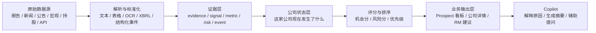

# InsightSync 产品逻辑与路线图

日期: 2026-05-06

## 1. 一句话目标

InsightSync 的目标不是“收集数据”，而是把公司报告、市场信号和外部事件，变成 RM 可以直接使用的行动建议。

## 2. 最终产品长什么样

最终产品不是一个单一的数据库，也不是一个只会问答的 Copilot，而是一个从“数据 -> 证据 -> 公司状态 -> 机会/风险 -> 行动建议”的完整链路。

## 3. company 和 prospect 到底是什么关系

### company

company 是“公司本体”。

它表示一家公司本身的长期档案，例如：
- 公司名称
- 股票代码 / 法人主体
- 所属行业
- 地区
- 网址 / 别名 / 关联标识
- 历史证据和状态变化

它更像是“事实底座”。

### prospect

prospect 是“当前值得跟进的业务对象”。

它不是另一家公司，而是同一家公司在业务视角下的工作条目：
- 这家公司现在值不值得 RM 跟进
- 当前应该优先看什么机会
- 当前主要风险是什么
- 应该推什么产品
- 为什么现在要跟进

它更像是“业务视图”。

### 简单理解

可以把它理解成：

- `company` = 这家公司是谁
- `prospect` = 这家公司现在是不是值得跟、为什么值得跟、怎么跟

也就是说，company 是底层，prospect 是上层。

## 4. 整条业务链路怎么跑

### 第一步: 数据进入系统

系统从多个来源接数据，例如：
- 公司报告
- 公告
- 行业新闻
- 宏观指标
- 持股排名
- API / CSV / 爬虫内容

### 第二步: 解析成证据

不直接拿原始文件做判断，而是先变成结构化证据：
- 文本内容
- 表格指标
- 风险因子
- business event
- signal
- summary

### 第三步: 证据归到公司

系统把证据归入 company：
- 直接提到公司名，就直接关联
- 没有直接提到公司名，但提到行业、地区、跨境暴露，就按规则映射到相关公司

这里的核心不是“文件属于哪个 source”，而是“这些证据说明了这家公司当前发生了什么”。

### 第四步: 生成公司状态

系统把多条证据合并成 company latest-state，例如：
- 最近有没有新公告
- 最近有没有融资/扩张/并购信号
- 最近报告里有没有风险描述
- 有没有管理层讨论摘要
- 有没有宏观环境支持

这一步回答的是：

“这家公司现在处于什么状态？”

### 第五步: 打分和排序

系统根据公司状态做两个动作：
- 排序: 哪些公司应该优先看
- 评分: 这家公司机会大不大 / 风险高不高

这一步回答的是：

“先看谁，为什么？”

### 第六步: 输出业务动作

最终系统输出的不是原始数据，而是业务动作：
- Prospect 看板
- 公司详情页
- 风险提示
- 产品建议
- 下一步跟进建议
- Copilot 解释

这一步回答的是：

“RM 现在该做什么？”

## 5. PR #10 在整条链路里的位置

PR #10 代表的是产品逻辑从“数据层”往“业务层”推进了一大步。

它做了这些事：
- 新增 prospect 层
- 新增 curated evidence / signal / score
- 新增 dashboard-ready API
- 新增 copilot / brief / question 接口
- 新增统一的中间表和 workflow

它的方向是对的，因为它开始把系统往“RM 可用”推进。

但它还不是最终形态，因为：
- 仍然有大量规则驱动
- curated builder 过重
- company 和 prospect 的边界还需要整理
- 脏文件和运行产物混进了 PR
- 部分逻辑还没有形成稳定的产品定义

所以它更像是“产品层的原型”，不是最后可直接交付的成品。

## 6. 当前最合理的产品分层

建议按下面这三层来理解：

### A. 事实层

负责记录真实世界发生了什么。

包括：
- company
- report
- announcement
- news
- metric
- event
- signal

### B. 业务层

负责把事实变成业务对象。

包括：
- prospect
- latest-state
- score
- reason
- recommended product
- next action

### C. 交互层

负责把业务对象讲给人听。

包括：
- dashboard
- company detail
- copilot
- brief
- questions

## 7. 现在最应该做什么

下一步不应该继续无脑加 source，而应该先把产品骨架整理稳。

建议顺序是：

1. 先清理 PR #10 的脏文件和运行产物
2. 把 curated builder 拆小，减少单点复杂度
3. 明确 company / prospect 的边界
4. 建立稳定的 company latest-state
5. 用 feature 方式做 score，而不是只靠临时规则
6. 再把 Copilot 用在摘要、解释和建议上

## 8. 对协作者的推荐说法

你可以这样描述当前路线：

“InsightSync 现在已经不只是收集数据，而是在把多源数据转成证据，再聚合成公司状态、机会排序和 RM 跟进建议。company 是底层事实档案，prospect 是业务视角下的跟进对象。PR #10 代表我们开始把系统从数据底座推向产品层，但还需要整理结构、稳定评分和清理脏文件，之后才能作为正式的业务输出层继续往前做。”

