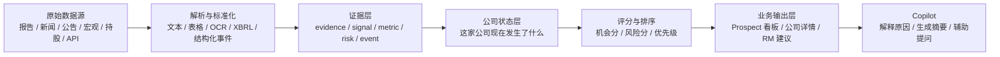

# InsightSync 产品逻辑与路线图

日期: 2026-05-06

## 1. 一句话目标

InsightSync 的目标不是“收集数据”，而是把公司报告、市场信号和外部事件，变成 RM 可以直接使用的行动建议。

## 2. 最终产品长什么样

最终产品不是一个单一的数据库，也不是一个只会问答的 Copilot，而是一个从“数据 -> 证据 -> 公司状态 -> 机会/风险 -> 行动建议”的完整链路。

## 3. company 和 prospect 到底是什么关系

### company

company 是“公司本体”。

它表示一家公司本身的长期档案，例如：
- 公司名称
- 股票代码 / 法人主体
- 所属行业
- 地区
- 网址 / 别名 / 关联标识
- 历史证据和状态变化

它更像是“事实底座”。

### prospect

prospect 是“当前值得跟进的业务对象”。

它不是另一家公司，而是同一家公司在业务视角下的工作条目：
- 这家公司现在值不值得 RM 跟进
- 当前应该优先看什么机会
- 当前主要风险是什么
- 应该推什么产品
- 为什么现在要跟进

它更像是“业务视图”。

### 简单理解

可以把它理解成：

- `company` = 这家公司是谁
- `prospect` = 这家公司现在是不是值得跟、为什么值得跟、怎么跟

也就是说，company 是底层，prospect 是上层。

## 4. 整条业务链路怎么跑

### 第一步: 数据进入系统

系统从多个来源接数据，例如：
- 公司报告
- 公告
- 行业新闻
- 宏观指标
- 持股排名
- API / CSV / 爬虫内容

### 第二步: 解析成证据

不直接拿原始文件做判断，而是先变成结构化证据：
- 文本内容
- 表格指标
- 风险因子
- business event
- signal
- summary

### 第三步: 证据归到公司

系统把证据归入 company：
- 直接提到公司名，就直接关联
- 没有直接提到公司名，但提到行业、地区、跨境暴露，就按规则映射到相关公司

这里的核心不是“文件属于哪个 source”，而是“这些证据说明了这家公司当前发生了什么”。

### 第四步: 生成公司状态

系统把多条证据合并成 company latest-state，例如：
- 最近有没有新公告
- 最近有没有融资/扩张/并购信号
- 最近报告里有没有风险描述
- 有没有管理层讨论摘要
- 有没有宏观环境支持

这一步回答的是：

“这家公司现在处于什么状态？”

### 第五步: 打分和排序

系统根据公司状态做两个动作：
- 排序: 哪些公司应该优先看
- 评分: 这家公司机会大不大 / 风险高不高

这一步回答的是：

“先看谁，为什么？”

### 第六步: 输出业务动作

最终系统输出的不是原始数据，而是业务动作：
- Prospect 看板
- 公司详情页
- 风险提示
- 产品建议
- 下一步跟进建议
- Copilot 解释

这一步回答的是：

“RM 现在该做什么？”

## 5. PR #10 在整条链路里的位置

PR #10 代表的是产品逻辑从“数据层”往“业务层”推进了一大步。

它做了这些事：
- 新增 prospect 层
- 新增 curated evidence / signal / score
- 新增 dashboard-ready API
- 新增 copilot / brief / question 接口
- 新增统一的中间表和 workflow

它的方向是对的，因为它开始把系统往“RM 可用”推进。

但它还不是最终形态，因为：
- 仍然有大量规则驱动
- curated builder 过重
- company 和 prospect 的边界还需要整理
- 脏文件和运行产物混进了 PR
- 部分逻辑还没有形成稳定的产品定义

所以它更像是“产品层的原型”，不是最后可直接交付的成品。

## 6. 当前最合理的产品分层

建议按下面这三层来理解：

### A. 事实层

负责记录真实世界发生了什么。

包括：
- company
- report
- announcement
- news
- metric
- event
- signal

### B. 业务层

负责把事实变成业务对象。

包括：
- prospect
- latest-state
- score
- reason
- recommended product
- next action

### C. 交互层

负责把业务对象讲给人听。

包括：
- dashboard
- company detail
- copilot
- brief
- questions

## 7. 现在最应该做什么

下一步不应该继续无脑加 source，而应该先把产品骨架整理稳。

建议顺序是：

1. 先清理 PR #10 的脏文件和运行产物
2. 把 curated builder 拆小，减少单点复杂度
3. 明确 company / prospect 的边界
4. 建立稳定的 company latest-state
5. 用 feature 方式做 score，而不是只靠临时规则
6. 再把 Copilot 用在摘要、解释和建议上

## 8. 当前已经做到哪里

截至 2026-05-06，主线已经从“只有数据和底层信号”推进到了“可以支撑首页、prospect 列表、prospect 详情和 copilot 交互”的阶段。

### 已完成的主线能力

#### A. company 事实层

已经形成较稳定的 company latest-state 聚合结果，能够把多源证据整理成统一的公司状态视图，至少包括：
- latest_state
- opportunity_signals
- risk_signals
- coverage_flags
- signal_highlights

这意味着系统已经不只是“查原始数据”，而是可以回答：

“这家公司最近发生了什么，哪些信息值得业务关注？”

#### B. prospect 业务层

已经建立第一版 prospect 业务层，并且明确是“从 company latest-state 派生出来”，而不是重新造一套和 company 并行的事实模型。

当前已实现：
- prospect list
- prospect detail
- prospect signals
- prospect timeline
- prospect evidence
- explainable score breakdown
- recommended next step
- recommended product themes

这意味着系统已经可以回答：

“哪些公司值得优先跟进，原因是什么，下一步该怎么做？”

#### C. interaction 交互层

已经补齐第一版 banker-facing 交互层：
- dashboard summary
- dashboard market overview
- dashboard priority prospects
- dashboard trigger signals
- prospect brief
- prospect question
- prospect copilot

这意味着系统已经具备“首页可展示、详情可解释、问题可追问”的基础交互能力。

### 当前还没有完成的部分

虽然已经有了产品主线，但还不是最终交付形态，主要还差下面几块：

1. prospect 还没有独立持久化的 workflow state
现在的 prospect 仍然主要是从 company_id 派生出来的业务视图，还没有 owner、stage、last_action、RM notes 这类真正的业务工作流状态。

2. score 还是第一版 explainable feature 逻辑
现在的好处是可解释、稳定、容易调试；但它还不是最终成熟的银行级评分体系，后面要继续引入更系统的 feature、权重和校准逻辑。

3. company size / financial profile 还不完整
所以 dashboard 里的 `company_size_breakdown` 目前故意返回空数组，而不是编造一个不真实的分桶结果。

4. Copilot 已经接上，但还不是最终“深度融合”形态
现在 Copilot 更偏解释、摘要和问答增强；后面还要继续把它和 signal fusion、action recommendation、human-in-the-loop 审核结合起来。

## 9. PR #10 现在算不算“吸收了”

结论是：

不是“整包 merge 了 PR #10”，而是“吸收了 PR #10 里有价值的产品目标，并用更干净的主线实现重建出来了”。

### 已经吸收的部分

PR #10 里最有价值的方向，当前主线已经基本吸收：
- prospect 这一层业务对象
- explainable score / reason 这一层
- dashboard-ready API 这一层
- brief / question / copilot 这一层

也就是说，从产品能力上看，PR #10 想推动的主方向，现在已经沿着更清晰的架构落地了。

### 没有直接吸收的部分

PR #10 里下面这些问题，没有被原样继承：
- 过重的 curated builder 风格实现
- company 和 prospect 边界不清的结构
- 脏文件、运行产物、临时目录
- 过多中间表和 workflow 复杂度

也就是说，当前路线不是“把 PR #10 原样接进来”，而是“保留它正确的产品意图，舍弃它不稳定的实现方式”。

## 10. 下一步该做什么

下一步应该继续沿着当前主线往下做，而不是重新回到“每来一个 source 就往里堆一层脚本”的模式。

建议顺序：

1. 先把当前 dashboard / prospect / copilot 这一阶段稳定下来
包括文档同步、测试补齐、API 契约固定、前端可对接说明补全。

2. 再做 prospect workflow state
把 owner、stage、follow-up status、notes 这类真正业务流程字段加进来，让 prospect 从“派生视图”进化成“可运营对象”。

3. 再做 score feature 化和校准
把现在的 explainable score 从“第一版规则特征组合”升级成“可维护、可调参、可解释”的正式评分体系。

4. 再把 Copilot 更深地接到融合与行动建议上
让它不只是回答问题，而是解释“为什么给出这个 prospect、为什么给出这个信号、建议下一步联系什么产品/场景”。

5. 最后再继续扩更多 source
这时再接新 source，才不会让系统重新变回“数据越多越乱”的状态。

## 11. 对协作者的推荐说法

你可以这样描述当前路线：

“InsightSync 现在已经从单纯的数据采集，推进到了 company 状态聚合、prospect 排序和 banker-facing API 的阶段。company 是事实底座，prospect 是业务视图，dashboard/copilot/brief 是交互层。PR #10 的产品方向我们已经吸收了，但不是直接继承它的实现，而是沿着更清晰的主线重建。下一步不是盲目扩 source，而是把 prospect workflow、评分体系和 Copilot 融合做扎实。”
